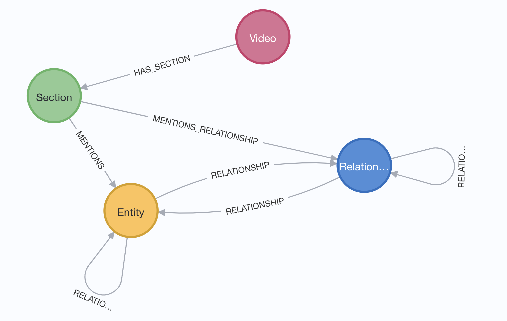

# video2graph

# prepare the python environment
Install Python 3.8 on your laptop

# optionally, you may prepare the virtual environment
 1. create a virtual environment
python3 -m venv my_env
 2. activate the virtual environment
source my_env/bin/activate

# prepare your OPENAI API KEY

openai.api_key = OPENAI_API_KEY

# prepare your Neo4j desktop environment
uri = neo4j_URL
username = neo4j_user_name
password = neo4j_passsord

